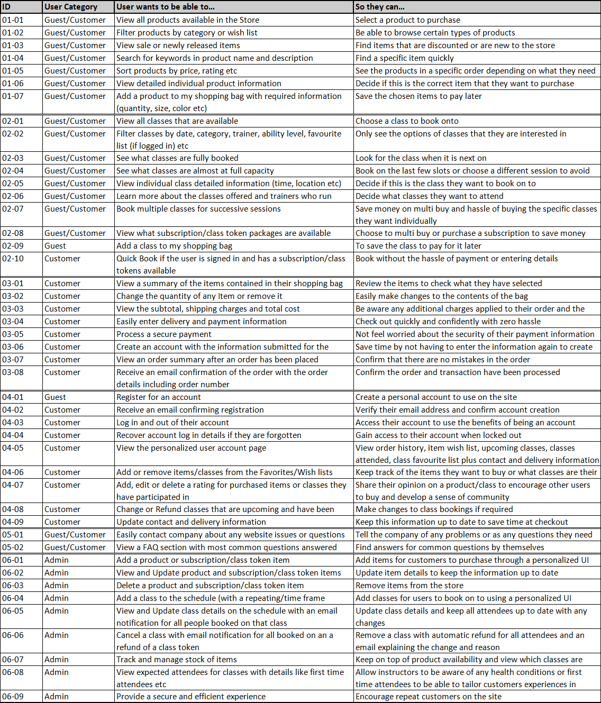

# Studio - Online Fitness Platform
This project is designed to fufill the needs of a gym or fitness center and to help them grow their online sales.

[Link to Live Project](#)

This is the last of the Milestone Projects that make up the Full Stack Web Development Program at The Code Institute. The main requirements of this project are to *"build a full-stack framework based around business logic used to control a centrally-owned dataset"* using the technologies: **HTML**, **CSS**, **Javascript**, **Python+Django** with a relational database and using the Stripe payments system.

This e-commerce platform allows a small to medium size fitness business to transition from in person to online sales of products and class admittence, and will drive a growth in sales with the oppertunity to support fully online operation. Working fully online can be an avenue for business development however the need for this functionality/ability was emphasized most recently by the COVID pandemic where many in person businesses were forced to move online.

---

# User Stories

My user stories are broken up into categories indicated by their ID number. A **Guest** is a Non-Account Holder and a **Customer** is an Account Holder

| ID | Category Name |
| --- | --- |
| 01 | Merchandise |
| 02 | Class Booking |
| 03 | Shopping Bag and Checkout |
| 04 | User Account |
| 05 | Miscellaneous |
| 06 | Admin |

