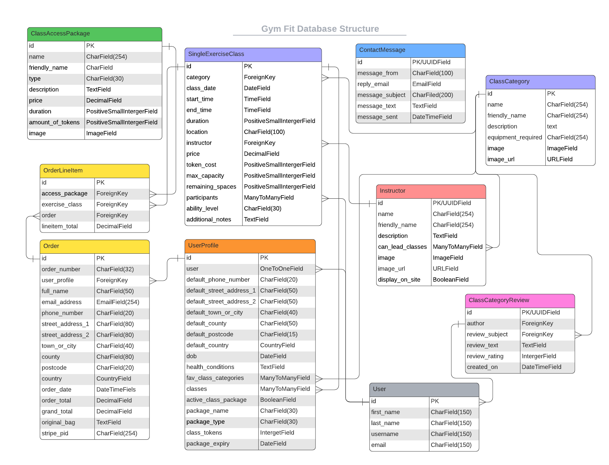

# Gym Fit - Group Fitness E-Commerce Platform
This project is designed to fufill the needs of a gym or fitness center looking to move thier booking system online and to help them grow their online sales.

[Link to Live Project](#)

This is the last of the Milestone Projects that make up the Full Stack Web Development Program at The Code Institute. The main requirements of this project are to *"build a full-stack framework based around business logic used to control a centrally-owned dataset"* using the technologies: **HTML**, **CSS**, **Javascript**, **Python+Django** with a relational database and using the Stripe payments system.

This e-commerce platform allows a small to medium size fitness business to transition from in person to online sales of products and class admittence, and will drive a growth in sales with the oppertunity to support fully online operation. Working fully online can be an avenue for business development however the need for this functionality/ability was emphasized most recently by the COVID pandemic where many in person businesses were forced to move online.

---

# **Strategy**

# User Stories

My user stories are broken up into categories indicated by their ID number. A **Guest** is a Non-Account Holder and a **Customer** is an Account Holder

| ID | Category Name |
| --- | --- |
| 01 | Class Booking |
| 02 | Shopping Bag and Checkout |
| 03 | User Account |
| 04 | Miscellaneous |
| 05 | Admin |

# **Structure**

The website functionality that is set out in the user stories can be broken down into 3 general categories using what features users are allowed to access at different permisson levels.

### 1. Permission Level 1 - Guest User/Not logged in
At this level, Users can;
- View all basic information about the business,
- View all individual classes avaliable for purchase,
- Add any individual class to their bag,
- Purchase the contents of the bag, by entering their information, and recieve confirmation of the transaction on completion,
- Create an account, either seperatly or as part of the check out procedure,

### 2. Permission Level 2 - User Logged In/Customer
At this level, Users can;
- Do everything from Permission Level 1,
- View all data stored in relation to their account, including basic details, address and order/class order history
- Update their account information, via their account Profile page
- Add classes to their favourite lists
- Buy class tokens or a subscription
- Leave rating on classes attended

### 3. Permission Level 3 - Admin
At this level, Users can;
- Do everything from Permission Level 1 and 2
- Create, View, Edit or Delete classes and class categories
- View details about the classes and attendees
- Manage instructor profiles
- Recieve customer communications

# Database Schema

To deliver the required functionality, I have used a relational database to store and access any associated data. 

SQLlite was used in the development phase and Postgres, as provided by Heroku, was used in live production.

This diagram shows the database models and the relationship between them.

# Skeleton

## Wireframes

[Link to all the Wireframe designs for this project](readme/assets/wireframes.md)

# Technology Used

### Documentation
- [TinyPNG](https://tinypng.com/) - Image Compression
- [CompressPNG](https://compresspng.com/) - Image Compression