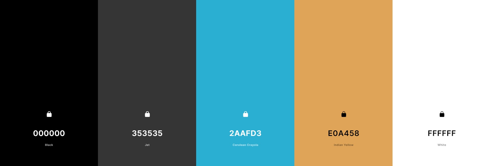

# **Gym Fit - Group Fitness E-Commerce Platform**

This project is designed to fufill the needs of a gym or fitness center looking to move thier booking system online and to help them grow their online sales.

**DISCLAIMER** - This project is for educational purposes only. This project has no affiliation with any professional companies.

[Link to Live Project](https://gym-fit-ms4.herokuapp.com/)

This is the last of the Milestone Projects that make up the Full Stack Web Development Program at The Code Institute. The main requirements of this project are to *"build a full-stack framework based around business logic used to control a centrally-owned dataset"* using the technologies: **HTML**, **CSS**, **Javascript**, **Python+Django** with a relational database and using the Stripe payments system.

This e-commerce platform allows a small to medium size fitness business to transition from in person to online sales of products and class admittance, and will drive a growth in sales with the opportunity to support fully online operation. Working fully online can be an avenue for business development however the need for this functionality/ability was emphasized most recently by the COVID pandemic where many in person businesses were forced to move online.

## **STRATEGY**

### **Project Goals**

- Develop an e-commerce website to promote a fitness class business and to move their booking system online to improve productivity and efficiency in the booking system to increase customer sales and customer retention
- Create an Admin access account on the platform to allow the company to make the required changes to the data sets in the database
- Produce a secure and comprehensive backend structure, including database hosting any data stored online
- Build a smart and responsive web app to enable users to view displayed information easily
- Handle any errors in such a way to help the user understand the issue and provide an easy form of contact if any error should persist

### **Business Goals**

- Sell more classes online and start selling subscriptions or class access token packages
- Increase class attendance by assisting users to view, change or cancel their bookings with tokens refunded if applicable
- Streamline the booking system to reduce admin work and move towards a cashless business
- Expand the business by easily adding more classes and instructors when required
- Allow customers to find out more information about all the services provided by the business
- Be able to develop the platform later on to add more features including Instructor portals (including personalized schedules), attendance lists (with first time attendees and customer medical conditions to be aware of), mailing lists etc

### **User Demographic**

- Aged 18 to 45
- All genders and ethnicities
- Enjoy fitness and strive for a healthier lifestyle
- Live, work or are visiting in travelling distance from the business
- Interested in building and being an active part of a fitness community
- Comfortable using web apps and online payment systems

### **Value for the User/Customer**

- Easier access to class schedule and a more efficient booking system
- Friendly and intuitive interface
- Convenient email updates to any changes made to classes they are booked on to
- Secure storage of personal information to assist in more efficient payments
- Possibility to access more information about the company and services provided
- Track payments and classes attended
- Read other customer reviews of class and ability to share their personal views with others in their own review
- Opportunity to purchase subscriptions or class access token packages which were unavailable before

## **User Stories**

My user stories are broken up into categories indicated by their ID number. A **Guest** is a Non-Account Holder and a **Customer** is an Account Holder

| ID | Category Name |
| --- | --- |
| 01 | Class Booking |
| 02 | Shopping Bag and Checkout |
| 03 | User Account |
| 04 | Miscellaneous |
| 05 | Admin |

## **SCOPE**

### **Production Feature Planning Table**

After the initial planning session, an importance viability assessment was performed on all the features suggested and below are the results of this. I-V marks range from 1 to 5

| ID | Feature                                                                                          | Importance | Viability |
|----|--------------------------------------------------------------------------------------------------|------------|-----------|
| 01 | Register, Confirm, Update information in and Delete a User Account with confirmation emails      | 5          | 5         |
| 02 | Sign In and Out                                                                                  | 5          | 5         |
| 03 | Sign In and Out with other social media accounts                                                 | 3          | 4         |
| 04 | Recover account if login information is lost                                                     | 5          | 5         |
| 05 | View User's personal information, upcoming and previous classes and order history                | 5          | 5         |
| 06 | Update User's Personal Information                                                               | 5          | 5         |
| 07 | Create, View, Edit and Delete Class Categories                                                   | 5          | 5         |
| 08 | Schedule, View, Edit and Delete Classes                                                          | 5          | 5         |
| 09 | Filter classes by category, date, trainer, time, ability level and favourite class category list | 5          | 3         |
| 10 | Manage User's personal favourite class category list                                             | 4          | 5         |
| 11 | Schedule weekly classes until a set date or for a certain number of weeks                        | 3          | 3         |
| 12 | Book onto or add a class to the shopping bag                                                     | 5          | 5         |
| 13 | Delete a class booking with refund if required                                                   | 5          | 4         |
| 14 | View fully booked or almost full classes                                                         | 5          | 5         |
| 15 | Add customers to waiting lists if a class is full, with email notification on space opening up    | 3          | 5         |
| 16 | Purchase multiple classes with a weekly interval with a specified number of weeks                | 2          | 3         |
| 17 | Create, View, Edit and Delete Class Access Packages (Tokens or Unlimited)                        | 5          | 5         |
| 18 | Create, View, Edit and Delete Class Access Packages for specific class categories                | 3          | 5         |
| 19 | Create, View, Edit and Delete Instructor Profiles                                                | 4          | 5         |
| 20 | Allow Instructors to Update their publicly visible profiles and manage their classes             | 2          | 2         |
| 21 | Add purchasable items to the shopping bag                                                        | 5          | 5         |
| 22 | Securely process a purchase for items in the shopping bag                                        | 5          | 5         |
| 23 | View order confirmation on purchase completion with a confirmation email                         | 5          | 5         |
| 24 | Validate all User input                                                                          | 5          | 5         |
| 25 | Contact system with FAQs                                                                         | 5          | 5         |
| 26 | Links to business social media accounts                                                          | 5          | 5         |

The graph shows an axis of up to 6 however data scores range from 1 to 5 making a 5,5 the highest possible.

Not all users will be able to access all features.

#### **Analysis Conclusion**

After the analysis of the features suggested, all features will be implemented **apart** from feature **3, 11, 15, 16, 18, 20**. These have been removed due to complexity and time restraints mainly but have been added to the list of features for future releases.

**Feature 15 and 18** have been removed because time restraints have limited the amount of features that can be added. These features are possible however the importance category carries more weight in this instance.

**Feature 9** has been **included** in this release however it has been **amended**. The feature will now:

    "Filter classes by class category, date and favourite class category list only while sorting classes chronologically"

Removed functionality can be included in a later release.

The selected website functionality can be broken down into 3 general permission levels using what features users are allowed to access.

### 1. Permission Level 1 - Guest User/Not logged in

At this level, Users can;

- View all basic information about the business,
- View all individual classes available for purchase,
- Add any individual class to their bag,
- Purchase the contents of the bag, by entering their information, and receive confirmation of the transaction on completion,
- Create an account, either separately or as part of the checkout procedure,

### 2. Permission Level 2 - User Logged In/Customer

At this level, Users can;

- Do everything from Permission Level 1,
- View all data stored in relation to their account, including basic details, address and order/class order history
- Update their account information, via their account Profile page
- Add classes to their favourite lists
- Buy class tokens or a subscription
- Leave rating on classes attended

### 3. Permission Level 3 - Admin

At this level, Users can;

- Do everything from Permission Level 1 and 2
- Create, View, Edit or Delete classes and class categories
- View details about the classes and attendees
- Manage instructor profiles
- Receive customer communications

## **STRUCTURE**

## Topology

This diagram explains how the pages will be linked or accessed from each other. The red lines are Admin only access pathways. All the blue elements are accessible at all times from the navbar element.

## Database Schema

To deliver the required functionality, I have used a relational database to store and access any associated data.

SQLlite was used in the development phase and Postgres, as provided by Heroku, was used in live production.

This diagram shows the database models and the relationship between them.

Color Key for app that contains the model:

- Yellow - checkout
- Purple - classes
- Green - products
- Orange - profiles
- Grey - allauth provided
- Red - instructors
- Pink - reviews
- Blue - contact

### **Model Descriptions**

**User** - Provied by AllAuth application and contains basic user information including username, email etc. This model does not link to any other model but if filled by the Order model on occasion.

**UserProfile** - Stores more detail about a User and is created when the User signs up for a profile. Contains default informtion, used in Order and ContactMessage froms, as well as details about the classes the User has booked on to and the Users class packages, for example the amount of tokens they have to use and the package expiry date. This model is uses ClassCategory for its fav_class_category field and SingleExerciseClass for its classes field which are both ManyToManyFields

**SingleExerciseClass** - Model for all the single exercise class events that can be booked onto using a one time payment or class access package. The model including details like the class location, start time, instructor, price etc. This model is uses ClassCategory for its category ForeignKeyField, Instructor for its instructor ForeignKeyField and User for its participants ManyToManyField

**ClassCategory** - Model for the categories of exercise classes that are offered by GymFit. This model includes detail about the categories required equipment and a short description of the class category. This does't use any other model and was created first.

**ClassCategoryReview** - Model contains all the information for a review of a exercise class category like the review author, subject, rating etc. This mode uses the User model for its author field and ClassCategory model for its review_subject field which are both ForeignKeys.

**ClassAccessPackage** - Model for a type or puchasable product that will allow users access to book onto single exercise classes having unlimited access or a limited number of tokens attributed to their UserProfile. This model contains details such as the type of package, price, package duration until expiry etc. This model doesn't use any other models as the data contained with in it is generally used to alter the information in the UserProfile after purchase.

**Order** - Model that contains all the data related to a single user purchase of a Class Access Package and/or Single Exercise Classes. This model includes shipping details, order total price and the Stripe PID. This model uses the UserProfile model through a ForeignKey field.

**OrderLineItem** - A model for individual items in an order including what the item type and what order it belongs to." This model used the SingleExerciseClass, ClassAccessPackage and Order models as ForeignKeys.

**Instructor** - This model contains the information about the instructors that work at GymFit like their description and if they will be shown on the website. This model uses the ClassCategory for its can_lead_classes ManyToManyField.

**ContactMessage** - Model for storing all the messages sent from the contact page to admin including information like senders name, email address and the message. This model doesn't use any other model as the data is stored as strings as there is not the functionality to reply on the site.

In the database, the OrderLineItem model is not necessary however, it has been included for code reusability and to speed up future develpment.

## **SKELETON**

### **Wireframes**

[Link to all the Wireframe designs for this project](readme/assets/wireframes.md)

### **Design Alterations**

During the building of GymFit some alterations were made to the initial wireframe designs. These are the main changes that were made:

|Page/Section |Alteration |Reason |
|-----|-----|-----|
|Confirm Class Booking/Cancel Class Booking Page |Removed pages completely |Used JS alert functions to achive a similar functionality |
|Home |Removed overlap of hero image and first image on page |Peer review testing feedback mentioned it as looking out of place |
|Home|Removed Shop and Health Bar sections |Feedback mentioned that the confused the User's understand of the purpose of the site initially |
|Profile |Moved the Admin Contrls into the Profile Pill Menu |Easier Access |
|Profile |Removed Delete Account button |Functionality not required |
|Add a Review |Removed Review Subject |Field not required |
|Class Booking |Split into Class This Week and Classes by Day |Allows the user to view classes on several days at once or one specific day |
|Class Booking |Full Calendar view date picker removed |Django limitations and an overcomplicated implementation process |
|Class Booking |Go to day button replaced with date picker and on change submit functionality |Improves the UX |
|Join Now |Packages display made full screen width |More in fitting with the other data layouts and allows for greater responsivness in the design |
|Instructor Management |Instructor Profiles Layout/Design |Allows for greater responsivness in the design |
|Schedule a Class Form |Form in a single column |More uniformity in design across the site|

### **Design Decisions**

Bootstrap provides a clean user-friendly appearance to the website which is easy to customise for the situation using its extensive supporting documentation.

**Colour Scheme**

I designed the colour scheme for this website from the logo image that was designed for me.

The colour scheme is high contrast and easily viewable. This is the final colour scheme I used:

All navigational sections are either on a grey (#353535) or a while (#FFFFFF) background with blue (#2AAFD3) or Black (#000) nav-links respectively. All buttons are black with white text or blue with black text. I chose these colours to keep the contrast up as much as possible
Mobile devices use a hamburger-menu-naigation button to access the full screen mobile navigation.

The forms and fields follow the same custom look consistently across the website. The corners of the inputs are slightly rounded with the outline of the input in a solid blue (#2AAFD3), which changes color if the input is not validated

**Typography**

To give the website a clean and professional look, I chose to use [Overlock](https://fonts.google.com/specimen/Overlock) for the headers and [Open Sans](https://fonts.google.com/specimen/Open+Sans) for the rest of the text to make it look as professional as possible.

## **FEATURES**

This is a full, page by page, breakdown of all the features & elements that have been implemented for the first production release of the Gym Fit E-Commerce platform.

### Multi Page Elements

**User Feedback** - All User Feedback messages will come in the form of "Toasts" supplied by Boostrap and displayed on the bottom right of the screen. These Toasts change heading color and contents depending on the message displayed

**Navbar**
- Logo - to establish identity and act as a home button
- "Our Classes" - links to Class Category display to show the user what class types are on offer
- "Book Classes" Dropdown Menu which links to:
    - "Classes This Week" which allows the user to see and filter all the classes this week
    - "Classes By Day" which allows the user to search for classes on individual days and filter the classes found
- "Join Now" - Links to the "Join Us" page which shows the user the Class Access Packages the company has to offer
- "Contact" - Links to the Contact page

**Top Navbar**
- "My Account" - When a User is signed in this links to the Users profile page but when the User is a Guest it is a dropdown menu which links too
    - Register to allow the User to create an Account or 
    - Sign In to allow a User to sign into an existing account
- Shopping Cart Icon - Links to the Users current bag display

At Mobile screen widths, the Navbar links will be contained in a full screen menu which can be toggled with a button on the Navbar.

**Footer**
- Logo - to establish identity and act as a home button
- Links to socials for promotion and to encourage user engaguement
- Address of GymFit

### Home App

**View Home Page - /**
- Our Team Display - Display generated from Instructor models in the database. Each model has a display_on_site field which determines which instructors are show. A maximum of 8 instructors will be displayed
- Map and Links section - Links to GymFit instagram account and location on GoogleMaps. Image provided to represent use of GoogleMaps API.

### Classes App

**All Class Categories - /classes/our_classes/**
- Card Display of Individual Class Categories which includes:
    - Average Rating display data generated from ClassCategory Model,
    - Heart Icon Button to Add or Remove the Class Category from the Users Favourite Class Categories list,
    - "View Class Details" button links to /classes/class_category/<category_id> for the specific Class Category
- "Add Class Category" Button (ADMIN) - Link to classes/class_category/add

**Class Category Details - /classes/class_category/<category_id>/**
- Class Category details including Name, Representation Image, Average Ratings and Description
- Heart Icon Button to Add or Remove the Class Category from the Users Favourite Class Categories list,
- "Update Class Category" Button (ADMIN) - links to /classes/class_category/<category_id>/edit
- "Delete Class Category" Button (ADMIN) - deletes the selected Class Category after a confirmation check
- Class Category Reviews section which displays all reviews left for the class ordered newest to oldest. If user has left a review, a delete review button is displayed beside their review if they wish to remove it and the "Write a Review" button is hidden. If the User is a Guest they are prompted to sign up/in to be able to add a review.
- "Write a Review" Button - links to Add Category Review to allow a user to add a review

**Add a Class Category - classes/class_category/add** (ADMIN)
- ClassCategoryForm displayed using Crispy Forms with labels
- Cancel button - Links to All Class Categories
- "Add Class Category" Button - Validates form and adds new Class Category to the database, redirecting to the Class Category Details for the Category just created

**Edit a Class Category - classes/class_category/<category_id>/edit** (ADMIN)
- ClassCategoryForm which is filled with current Category data, displayed using Crispy Forms with labels
- Cancel button - Links to Class Category Details for the class you were editing
- "Edit Class Category" Button - Validates form, updates the Class Category in the database and redirects to the Class Category Details for the Category just edited

**Classes this Week - /classes/classes_this_week/**
- Single Exercise Class Display - Individual Responsive display items for the scheduled classes from the current date until 8 days in the future (to include the same day a week later). If no classes are scheduled, the date will not display. These display items include:
    - Details about the event including date, start time, ability level, location, cost(in tokens or currency depending on user package status) etc
    - Add to Bag button - Adds the selected class to the users shopping bag
    - Book with Tokens button - Books the user onto the class by adding the user to the class participants and the class to the users classes and updates the users package status
    - Edit Class (ADMIN) - links to the Edit Single Exercise Class page
    - Cancel Class Button (ADMIN) - deletes the selected Single Exercise Class after a confirmation check, sends a notification to all participants and refunds tokens
- "Filter By" Dropdown Menu - On selection filters the classes displayed by any single Class Category or using the categories in the Users Favourite Category List
- "Classes By Day" Button - links to Classes by Day

**Classes by Day - /classes/classes_by_day/**

- Single Exercise Class Display - Same as Classes this Week
- "Filter By" Dropdown Menu - On selection filters the classes displayed using any single Class Category or using the categories in the Users Favourite Category List
- "Classes on" Date Select -  On selection filters the classes displayed using the chosen date
- "Classes This Week" Button - links to Classes this Week

**Schedule a Single Exercise Class - /classes/single_class/add/** (ADMIN)
- SingleExerciseClassForm displayed using Crispy Forms with labels
- Cancel button - Links to Profile as that is the only place you can schedule a class from
- "Schedule Class" Button - Validates form and adds new Single Exercise Class to the database, redirecting to Classes This Week

**Update a Single Exercise Class - /classes/single_class/edit/** (ADMIN)
- SingleExerciseClassForm which is filled with current Exercise Class data, displayed using Crispy Forms with labels
- Cancel button - Links to Class Category Details for the class you were editing
- Edit Class Category Button - Validates form, updates the Class Category in the database and redirects to the redirecting to Classes This Week

### Products App

**View Class Access Packages - /products/class_access_packages/**
- Display for Token Packages including a repesentation image, package name, popover with more information and package price, ordered by price
- Display for Unlimited Use Packages including a repesentation image, package name, popover with more information, package expiry and package price
- Edit Class (ADMIN) - links to the Edit Class Access Package page
- Delete Package Button (ADMIN) - deletes the selected Class Access Package after a confirmation check and redirects to View Class Access Packages
- Add a Tokens Package / Add an Unlimited Package (ADMIN) - links to Add a Class Access Package

**Add a Class Access Package - classes/class_category/add/** (ADMIN)
- ClassAccessPackageForm displayed using Crispy Forms with labels
- Cancel button - Links to Profile
- "Add Access Package" Button - Validates form and adds new Class Access Package to the database, redirecting to View Class Access Packages

**Edit a Class Access Package - classes/class_category/<package_id>/edit/** (ADMIN)
- ClassCategoryForm which is filled with current Category data, displayed using Crispy Forms with labels including JS check on value of select to see if Class Tokens should be disabled or not
- Cancel button - Links to Class Category Details for the class you were editing
- "Edit Class Category" Button - Validates form, updates the Class Category in the database and redirects to the Class Category Details for the Category just edited

### Contact App

**Contact Page - /contact/**
- ContactMessageForm displayed using Crispy Forms with labels. If user is annonomous then name and email inputs are provided. If user is signed in then these details are provided from the database.
- Cancel button - Links to Home
- "Send Message" Button - Validates form, saves data to database and display sent message user feedback after reloading the page

### Profiles App

**Profile Page - /profile/**
- All sections are accessable from the profile menu buttons.
- Personal Details Section - contains UserForm and UserProfileForm prefilled with existing User information which can be updated by the "Update Information" button below the forms
- My Booking Section - Display of Upcoming and Previous classes the used has booked onto. Upcoming class display includes a button to cancel their booking which will remove the user from the class participants and remove the class forom the users profile and issuing a class token refund if cancellation notice is more than 24 hours.
- Previous Purchases Section - Display all the previous orders in the users account with a link to Previous Order Details which is the same as Checkout Success but has a few notes explains that it is a previous order and 
- Favourite Class List - Contains all Class Categories in the users Faviourite Class Category List with a button to remove the from the list if desired

- Admin Messages Section (ADMIN) - Displays all the user messages to admin, including sender name and reply email, sorted by date sent with a delete button to remove the messages individually
- "Add A Class Catergory" Button (ADMIN) - links to Add a Class Category
- "Schedule a Class" Button (ADMIN) - links to Schedule a Single Exercise Class
- "Create A Class Access Package" Button (ADMIN) - links to Add a Class Access Package
- "Instructor Management" Button (ADMIN) - links to Instructor Management

- Sign Out Button - links to the AllAuth sign out confirmation page

### Bag App

**View Bag - /bag/**
- Displays the Class Access Package and individual classes in the Users bag, in seperate sections, with details including type, duration, location with the single classes ordered by date. Each item has a delete button with a popover explaining its functionand a remove confirmation notification with a toast message on completion.

### Checkout App

**Checkout - /checkout/**
- Displays order summay with Item names/details and cost with Total price below them
- Form for all the Users details including name, address and email which will be auto filled if the User is signed in
- Stripe Payment Element which will verify card number and details on entry with error messages displayed below
- "Back To Bag" button returns user to the Bag page
- "Complete Order" button processes order, disabling and hiding form and buttons with an overlay which is removed on completion and redirects to Checkout Success. Any Card issues are dealt with on the processing overlay. If any errors with the form, User is bounced back to the Checkout page.

**Checkout Success - /checkout_success/<order_number>/**

- Displays a full Order Review with all details useing in the order including items purchased, billing information and the order date and number with a confirmation email sent to the supplied email address.
- This page is also used for the Profile Previous Order Details display

### Reviews App

**Write A Class Category Review - /reviews/<category_id>/add/**
- Title with Category Name included in it
- ClassCategoryReviewForm with validation messages
- Cancel Button which redirects to the chosen Category
- "Submit Review" button which validates data, creates and stores the review and redirects to the Category Details page

### Instructors App (ADMIN)

**Instructor Management - /instructors/instructor_management/** (ADMIN)
- "Add An Instructor" button links to the Add an Instructor Page
- Instructor Profile Display Cards which include:
    - Instructor Name
    - Profile Picture
    - List of Classes the Instructor can lead
    - Icon for if the account is being displayed on the website
    - "Edit Instructor" button which links to the Edit Instructor page for the chosen Instructor
    - Delete instructor icon with popover to explain its function with a delete confirmation message on click

**Add an Instructor - /instructors/instructor_management/add/** (ADMIN)

- InstructorForm with validation messages
- Cancel button which redirect to Instructor Management
- "Add Instructor" buttons validates form data and adds Instructor to database redirecting to Instructor Management

**Edit an Instructor - /instructors/instructor_management/add/** (ADMIN)

- Instructor Form pre-filled with existing Instructor data with validation messages
- Cancel button which redirect to Instructor Management
- "Update Instructor" buttons validates form data and updates Instructor data in database with user feedback message

### **CRUD Table**

This table shows what CRUD functionality is avaliable from what page.

| Page | Create | Read | Update | Delete |
|-----|-----|-----|-----|-----|
| View Home Page - / ||Instructor Profiles|||
| All Class Categories - /classes/our_classes/ |Class Favourites List Category|Class Categories||Class Favourites List Category|
| Class Category Details - /classes/class_category/<category_id>/  |Class Favourites List Category|Single Class Category||Class Category, Class Favourites List Category, Category Review|
| Add a Class Category - classes/class_category/add |Single Class Category|||
| Edit a Class Category - classes/class_category/<category_id>/edit ||Single Class Category|Single Class Category||
| Classes this Week - /classes/classes_this_week/ |User Profile (Class Favourites List)|Single Exercise Classes, User Profile (Classes)||Single Exercise Class|
| Classes by Day - /classes/classes_by_day/ |User Profile (Class Favourites List)|Single Exercise Classes, User Profile (Classes)||Single Exercise Class|
| Schedule a Single Exercise Class - /classes/single_class/add/ |Single Exercise Class||||
| Update a Single Exercise Class - /classes/single_class/edit/ ||Single Exercise Class|Single Exercise Class||
| View Class Access Packages - /products/class_access_packages/ ||Class Access Packages|||
| Add a Class Access Package - classes/class_category/add/ |Class Access Package||||
| Edit a Class Access Package - classes/class_category/<package_id>/edit/ ||Class Access Package|Class Access Package||
| Contact Page - /contact/ ||User Profile||
| Profile Page - /profile/ ||User Profile ||User Profile (Class Favourites List Category, Class Booking)|
| View Bag - /bag/ ||Bag Contexts||Bag Context Items|
| Checkout - /checkout/ ||Bag Contexts|||
| Checkout Success - /checkout_success/<order_number>/ ||Order|||
| Write A Class Category Review - /reviews/<category_id>/add/ |Category Review|Category|||
| Instructor Management - /instructors/instructor_management/ ||Instructor Profiles||Instructor Profile|
| Add an Instructor - /instructors/instructor_management/add/ |Instructor Profile||||
| Edit an Instructor - /instructors/instructor_management/add/ ||Instructor Profile|Instructor Profile||

### **Defensive Programming**

Throughout the building of this project I used the built in [Django Decorator login_required](https://docs.djangoproject.com/en/4.0/topics/auth/default/#the-login-required-decorator) to secure any functions that the User needs to have a verified account to use for example:

    @login_required
    def delete_contact_message(request, message_id):
        """View to allow admin to delete a message"""

If an unverified user attempted to access this function, they would be taken to the sign-in page to sign in or create an account.

There are several occasions where part of a function should run or only be access if the user account is verified. To facilitate this functionality, I have used the built in Django 

    .is_verified

User model attribute to avoid errors and to reduce the amount an unverified user can do.

To secure all Admin restricted functions I used a simple check of the [Django .is_superuser](https://docs.djangoproject.com/en/4.0/topics/auth/customizing/#custom-users-and-permissions) attribute included in its User model.

    if not request.user.is_superuser:
        messages.error(request, "Sorry, only Admin allowed")
        return redirect(reverse("home"))

If an unverified user attempted to access this function, they would be taken to the home page with an error user feedback message displayed.

### **Error Handling**

Error handling is being managed by the supplied functions and templates from Django to deal with any issues or bugs that are outside my control.

### **Features for Future Releases**

- Add customers to waiting lists if a class is full, with email notification on space opening up
- Purchase multiple classes with a weekly interval with a specified number of weeks
- Create, View, Edit and Delete Class Access Packages for specific class categories
- Allow Instructors to Update their publicly visible profiles and manage their classes
- Automated subscription payment service
- Messaging system to allow admin to respond to customers with accounts
- Add accessory products to the store like apparel, water bottles etc
- Refactor Profile into separate pages to allow redirection to specific sections
- Sign In and Out with other social media accounts
- When a Single Exercise Class is created or update, the Superuser would be taken to the day view for that class to make it easier to find.
- Update Stripe integration to the latest release from Stripe to improve functionality.

## **TESTING**

View the [Testing Document](readme/assets/testing.md)

## **BUGS AND ISSUES**

This is a table of the major bugs and issues that I experienced when building this project.

| **Bug ID** | **Description of Bug** | **Problem** | **Fix/Solution** |
|---|---|---|---|
| 1 | Font Awesome not providing icons | Issues with using the kit assigned to an email | Use a CDN link to import the icons |
| 2 | Dynamic URLS for images not rendering with {{MEDIA_URL}} | Variable not being passed to HTML files | Update context processors in settings.py |
| 3 | Table Header cells not removing with display none applied | Table Head elements don't respond to display:none | Added d-none to the row containing the Table Head |
| 4 | Dropdown Menu from bootstrap not working | Wrong version of Bootstrap | Added updated Bootstrap links |
| 5 | Multiple instances of the same date in week view | Not accessing the data from the dictionary, was referencing the entire dict | Added search storage list to add single values to and check against |
| 6 | Empty days showing on week view | Day label generation happening before the category filter | Rearranged functions to create day labels after filtering |
| 7 | Popovers broken | Was using Bootstrap 5 with popover JS and structure from Bootstrap 4 | Added correct Bootstrap 5 JS and changed attribute names in popovers to include "bs-" |
| 8 | Filters changing when add to bag clicked | URLs leaving out the filter variables being passed in initially | Add .get_full_path to redirect_url values in templates |
| 9 | GenericForeignKey not working due to not completely understanding how to call ContentType | ContentType matching query does not exist. | Refactored to remove the use of the GenericForeignKey |
| 10 | User variables storing as tuples | Added comma to end of assignment so it generated a tuple | Removed the comma |
| 11 | Adding double expected tokens to account with TK purchase | Function being called in webhook handler even if order was found in database | Move function to after order creation in webhook |
| 12 | classes and packages pages not loading due to typeError | user being referenced to find profile when user is guest | Add conditionals to check if user is_authenticated |
| 13 | unable to find profile when user not signed in for review search for class category details | when guest, no profile was found | Removed the comma |
| 14 | AnonymousUser' object is not iterable for add to basket | when guest, no profile found for add to basket | Add if user is superuser  |
| 15 | After being directed to sign in for add class category to favourites, when sign in completed, typeError from having no redirect url | Redirect url is stored on page | Added an if check on the existence of the redirect url |
| 16 | Toast messages not showing | Multiple JavaScript on load functions in base.js | Combined both functions |
| 17 | Password validation failing from AllAuth | I had broken the password validator strings up to comply with PEP8 | Removed the line break |

### **Unresolved Bugs**

### **Known Limitations**

1. Deleting a product like a Class Access Package removes it from the Users Previous Orders so a Product Inactive Field Needs to be Put In to Keep the Product Existing but not have it shown on the Products Page.
2. The expiry date of an Unlimited Used package includes the current day so if the User buys it later in the day, they won't get full use out of it. To combat this, packages could be activated on the next full day or on a selected date.
3. If an AnonymousUser buys a SingleExerciseClass their details are added to the class participants but only in the checkout_success view which leaves it open to missing this step if the User diverts away before this function is called but after the Webhook is sent. The remaining_spaces field on the SingleExerciseClass model will still be reduced by 1 as this is included when the webhook handler searches for the existing order but the users details will not be saved if the Order object is created in the webhook handler.
4. AnonymousUser can book on to the same class multiple times when user can't
5. If a Users class access tokens are nearing their expiry date, they can just book a class and cancel it and the refund will update their token expiry date to 6 weeks time
6. Deleting a category will not refund all the Users booked onto future classes of that category (stored in the participants list)
7. Every time the Update Class button is clicked to update a Single Exercise Class the notification email is sent, even if nothing changes. The email only includes the details of class_date, start_time, location and duration, so if another detail is changed, it is not included on the email.
8. If there is an error in the Edit a Single Exercise Class function, it will redirect to the Classes this Week.

## **DEPLOYMENT**

For the steps required to deploy this project, please view the [GymFit Deployment Document](readme/assets/gym-fit-deployment-document.pdf)

## **TECHNOLOGY USED**

 Languages and Libraries

- [Django](https://www.djangoproject.com/) - Python Framework
- [HTML5](https://developer.mozilla.org/en-US/docs/Glossary/HTML5) - Programming Language
- [CSS 3](https://developer.mozilla.org/en-US/docs/Web/CSS) - Programming Language
- [JavaScript](https://developer.mozilla.org/en-US/docs/Web/JavaScript) - Programming Language
- [Python](https://www.python.org/) - Programming Language
- [Jinja](https://jinja.palletsprojects.com/en/3.0.x/) - Templating Language
- [jQuery](https://jquery.com/) - JavaScript Library
- [Bootstrap v5](https://getbootstrap.com/) - Library Import
- [Google Fonts](https://fonts.google.com/) - Typography Import
- [Font Awesome](https://fontawesome.com/) - Icon provider
- [AOS](https://github.com/michalsnik/aos) - Scroll Animation Library

 IDE and Version Control

- [Git Pod](https://gitpod.io/) - IDE (Integrated Development Environment)
- [Git](https://git-scm.com/) - Version Control Tool
- [Github](https://github.com/) - Cloud based hosting service to manager my Git Repositories
- [Code Institute GitPod Template](https://github.com/Code-Institute-Org/gitpod-full-template) - Provides GitPod extensions to help with code production

 Design and Development

- [Google Chrome Development Tools](https://developer.chrome.com/docs/devtools/) - Design/Development Tools
- [Figma](https://www.figma.com/) - Wireframe designer software
- [Balsamiq](https://balsamiq.com/) - Wireframe designer software
- [Coolors](https://coolors.co/) - Colour scheme generator
- [Lucid App](https://lucid.app/) - Diagram creator
- [Draw.io](https://app.diagrams.net/) - Flow chart creator

 Validation and Testing

- [CSS Beautifier](https://www.freeformatter.com/css-beautifier.html) - Beautifying CSS Code
- [JavaScript Validator](https://beautifytools.com/javascript-validator.php) - Validating JS code
- [Lambda Test](https://www.lambdatest.com/) - Browser Testing Cloud Service
- [Am I Responsive?](http://ami.responsivedesign.is/) - Webpage Breakpoint visualizer and image generator
- [Black](https://black.readthedocs.io/en/stable/)- Code Formatter

 Documentation

- [TinyPNG](https://tinypng.com/) - Image Compression
- [CompressPNG](https://compresspng.com/) - Image Compression
- [Markdown Table Generator](https://www.tablesgenerator.com/markdown_tables) - Markdown Table Production
- [Table Converter](https://tableconvert.com/excel-to-markdown) - Excel to Markdown table converter 

## **CREDITS**

### **Code snippets**

The full screen overlay navigation desgin and css was taken from [W3 School's How To - Full screen Overlay Navigation](https://www.w3schools.com/howto/howto_js_fullscreen_overlay.asp)

Some elements of the code in this project were taken from the Bootstrap documentation and then customised to fit their purpose, using their supplied styles and designs as a base. These elements were:

- [NavBar](https://getbootstrap.com/docs/5.0/components/navbar/) 
- [Toast Messages](https://getbootstrap.com/docs/5.0/components/toasts/) 
- [Popovers](https://getbootstrap.com/docs/5.0/components/popovers/)
- [Tabels](https://getbootstrap.com/docs/5.0/content/tables/)
- [Button Classes](https://getbootstrap.com/docs/5.0/components/buttons/)
- [Alerts](https://getbootstrap.com/docs/5.0/components/alerts/)
- [Dropdowns](https://getbootstrap.com/docs/5.0/components/dropdowns/)
- [List Groups ](https://getbootstrap.com/docs/5.0/components/list-group/)

### **Resources**

- [Code Institute Course Content](https://courses.codeinstitute.net/) - Code fundamental learning platform
- [Stack Overflow](https://stackoverflow.com/)
- [W3Schools](https://www.w3schools.com/)
- [Django Documentation](https://www.djangoproject.com/)

- Readme structure and component ideas from https://github.com/C-Undritz/Boardgame-Bazaar
- README template used to produce this documentation is from [Code Institute README Template](https://github.com/Code-Institute-Solutions/readme-template)

### **Content**

All reviews are provided by the users and only reflects the Users opinions.

GymFit location, address and google map images are based on [The Gym Group London Peckham Rye](https://www.thegymgroup.com/find-a-gym/peckham-rye/?utm_source=google&utm_medium=organic&utm_campaign=gmb-listing&utm_content=London%20Peckham%20Rye). The Gym Group has no affiliation with this project.

### **Media**

Gym Fit logo designed by [Hollie Coote](https://www.linkedin.com/in/hollie-coote-38306a146/?originalSubdomain=uk)

Images sourced from:

- [Pexels](https://www.pexels.com)
- [Pixabay](https://www.pixabay.com)
- [Unslapsh](https://www.unsplash.com)

### **Acknowledgements**

I would like to say a big thank you to my CI mentor Akshat, the CI Slack Community and my family and friends who have offered support and encouragement throughout the building of this project and the Code Institue Full Stack Web Development Course.