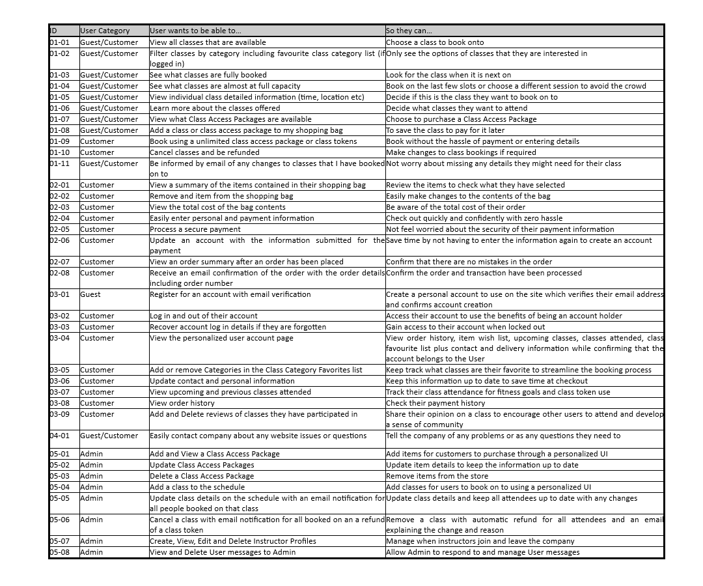

# **Gym Fit - Group Fitness E-Commerce Platform**

This project is designed to fufill the needs of a gym or fitness center looking to move thier booking system online and to help them grow their online sales.

[Link to Live Project](#)

This is the last of the Milestone Projects that make up the Full Stack Web Development Program at The Code Institute. The main requirements of this project are to *"build a full-stack framework based around business logic used to control a centrally-owned dataset"* using the technologies: **HTML**, **CSS**, **Javascript**, **Python+Django** with a relational database and using the Stripe payments system.

This e-commerce platform allows a small to medium size fitness business to transition from in person to online sales of products and class admittance, and will drive a growth in sales with the opportunity to support fully online operation. Working fully online can be an avenue for business development however the need for this functionality/ability was emphasized most recently by the COVID pandemic where many in person businesses were forced to move online.

---

## **Strategy**

---

### **Project Goals**

- Develop an e-commerce website to promote a fitness class business and to move their booking system online to improve productivity and efficiency in the booking system to increase customer sales and customer retention
- Create an Admin access account on the platform to allow the company to make the required changes to the data sets in the database
- Produce a secure and comprehensive backend structure, including database hosting any data stored online
- Build a smart and responsive web app to enable users to view displayed information easily
- Handle any errors in such a way to help the user understand the issue and provide an easy form of contact if any error should persist

### **Business Goals**

- Sell more classes online and start selling subscriptions or class access token packages
- Increase class attendance by assisting users to view, change or cancel their bookings with tokens refunded if applicable
- Streamline the booking system to reduce admin work and move towards a cashless business
- Expand the business by easily adding more classes and instructors when required
- Allow customers to find out more information about all the services provided by the business
- Be able to develop the platform later on to add more features including Instructor portals (including personalized schedules), attendance lists (with first time attendees and customer medical conditions to be aware of), mailing lists etc

### **User Demographic**

- Aged 18 to 45
- All genders and ethnicities
- Enjoy fitness and strive for a healthier lifestyle
- Live, work or are visiting in travelling distance from the business
- Interested in building and being an active part of a fitness community
- Comfortable using web apps and online payment systems

### **Value for the User/Customer**

- Easier access to class schedule and a more efficient booking system
- Friendly and intuitive interface
- Convenient email updates to any changes made to classes they are booked on to
- Secure storage of personal information to assist in more efficient payments
- Possibility to access more information about the company and services provided
- Track payments and classes attended
- Read other customer reviews of class and ability to share their personal views with others in their own review
- Opportunity to purchase subscriptions or class access token packages which were unavailable before

---

## **User Stories**

---

My user stories are broken up into categories indicated by their ID number. A **Guest** is a Non-Account Holder and a **Customer** is an Account Holder

| ID | Category Name |
| --- | --- |
| 01 | Class Booking |
| 02 | Shopping Bag and Checkout |
| 03 | User Account |
| 04 | Miscellaneous |
| 05 | Admin |

## **Structure**

The website functionality that is set out in the user stories can be broken down into 3 general categories using what features users are allowed to access at different permisson levels.

### 1. Permission Level 1 - Guest User/Not logged in

At this level, Users can;

- View all basic information about the business,
- View all individual classes available for purchase,
- Add any individual class to their bag,
- Purchase the contents of the bag, by entering their information, and receive confirmation of the transaction on completion,
- Create an account, either separatly or as part of the checkout procedure,

### 2. Permission Level 2 - User Logged In/Customer

At this level, Users can;

- Do everything from Permission Level 1,
- View all data stored in relation to their account, including basic details, address and order/class order history
- Update their account information, via their account Profile page
- Add classes to their favourite lists
- Buy class tokens or a subscription
- Leave rating on classes attended

### 3. Permission Level 3 - Admin

At this level, Users can;

- Do everything from Permission Level 1 and 2
- Create, View, Edit or Delete classes and class categories
- View details about the classes and attendees
- Manage instructor profiles
- Receive customer communications

## Database Schema

---

To deliver the required functionality, I have used a relational database to store and access any associated data.

SQLlite was used in the development phase and Postgres, as provided by Heroku, was used in live production.

This diagram shows the database models and the relationship between them.

---

## **Skeleton**

---

### **Wireframes**

[Link to all the Wireframe designs for this project](readme/assets/wireframes.md)

---

## **Technology Used**

---

### Documentation

- [TinyPNG](https://tinypng.com/) - Image Compression
- [CompressPNG](https://compresspng.com/) - Image Compression