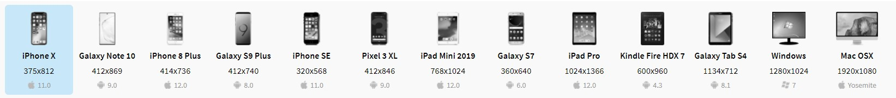
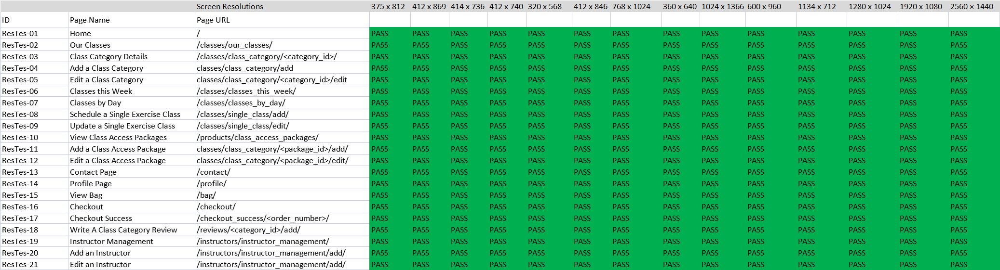
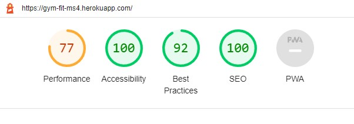
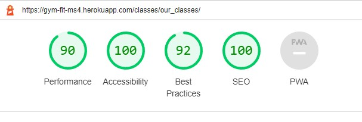
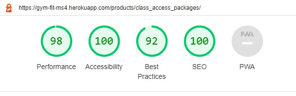
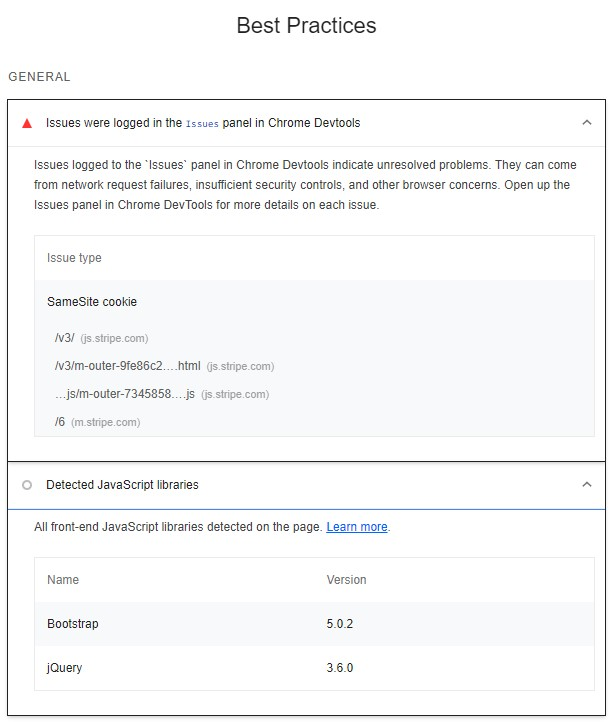
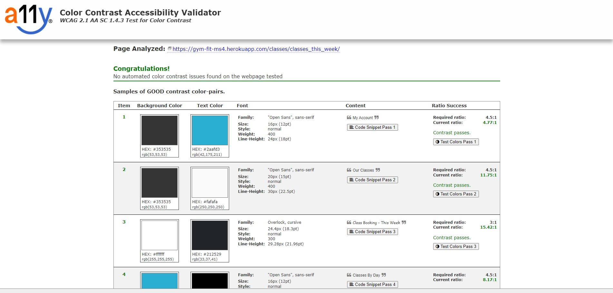
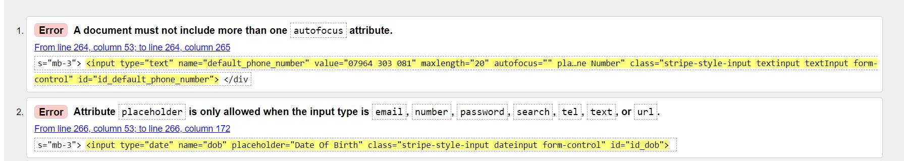

# Testing

# Manual Testing

## Features Testing
Find all my manual testing criteria, procedure and outcomes in my [Manual Testing Document](gym-fit-manual-testing-document.pdf)

## User Stories

For full details on the User Stories testing, please see my [User Stories Testing Document](gym-fit-user-stories-testing-document.pdf)

## Peer Review

I requested peer review feedback from my friends, family and the Code Institute slack community. Below you can find any issues or suggestions from my peers and any changes I made in response to the feedback. Apart from that logged below, all other peer review feedback was positive.

|Peer |Feedback Received |Action Taken |
|-----|-----|-----|
|Hollie Coote |Can only see 5 days in advance on the Classes this Week page |Altered the view to include the entire week plus 1 day |
|Anya McDonald |Class description seems too close to the image on the Class Details page |Added addition padding to this text section |
|Anya McDonald |2nd image on the home page seems out of place |Updated design |
|Anya McDonald |Would like some more about opening hours  |Added opening hours to the home page |
|Laila (Slack) |500 response when adding a package to their bag as a guest  |Added login_required decorator to prompt user to sign in/up to purchase a package |
|Tayla Joel |Would like to be able to sign in using social media accounts  |Added to the future development features list |
|Frannie Yip (Slack) |Missed the sent message notification. Maybe redirect to a different page to make it clearer the message has been sent  |Changed message redirect to the home page |

## Responsive Design 

After researching the most commonly used screen resolutions ([Screen Resolutions Research Link](https://www.browserstack.com/guide/responsive-design-breakpoints)), I tested the responsive design on all the pages in this project at the resolutions widths of:

as they are the very common resolutions. I carried out the tests using a combination of the [Browser Stack Responsive Design Tester](https://www.browserstack.com/responsive), [Media Genesis RESPONSIVE WEB DESIGN CHECKER](https://responsivedesignchecker.com/) and [Chrome Dev Tools](https://developer.chrome.com/docs/devtools/). 

I also added 2560 × 1440 screen resolution into the tests to enable site display durability as this resolution is becoming more widely used.

Here are the results to these tests:

During testing, I realised the Admin Messages table was acting responsively however this led to the table being horizontally scrollable, at smaller screen widths, which was hampering the UX. To correct this I refactored the Admin Message display to a custom design which was more responsive, before running my responsive tests again.

For device responsive testing I used:
- A Samsung Galaxy S10 (360px) as it is roughly in the middle of the range of screen sizes I tested for mobile, 
- A Samsung Galaxy Tab 4 Tablet (800px) as again it is roughly in the middle of the range of tablet screen resolutions test 
- A full HD 15" laptop and full HD 32" monitor (1920x1080).

## Browser Testing

I manually tested the project on the Browsers Firefox (version 94), Chrome (version 96) and Edge (version 95) on my Windows 10 machine and called a peer to talk them through testing the page on Safari (version 15.1), so I could manually test all browsers on desktop.

All features and designs were as expected.

# Automated Testing

## Performance - Lighthouse
I tested the Performance, Accessibility, Best Practices and SEO of GymFit using [Lighthouse](https://developers.google.com/web/tools/lighthouse) in Chrome Developer Tools.

|Page | Lighthouse result |
| --- | --- |
|Home |  |
|Our Classes |  |
|Join Us |  |

The results from all pages were similar to the results shown, for desktop and mobile. The main performance degradation happened when displaying images but especially the instructor images as they are being hosted remotely and I can not control the size of the hosted images. To solve this issue, the images could be stored in the project AWS storage. The model allows for external URLs to be used for the image and I wanted to test for the worst possible scenario after deployment.

The best practice issues have all come from the Stripe import. There is now an updated application for the Stripe system, which might remove these issues, that can be implemented in future releases.

## Colour Tester - A11y

To test the color contrast on GymFit I used [A11y the Color Contrast Accessibility Validator](https://color.a11y.com/). After testing a few pages, there were no issues found. Here is the result from the Classes this Week page as it contained all the color combinations that have been used in the project.

# Validation

### HTML

During the HTML validation, I came across 2 errors.

To correct these errors, I removed the autofocus attribute from the UserForm and modified the placeholder attribute assignment in the forms to exclude the input types that don't allow them.

To find the results of all my HTML validation, please see my [HTML Validation Document](gym-fit-html-validation-document.pdf)

### CSS

All the CSS files on the project were validated using the [The W3C CSS Validation Service](https://jigsaw.w3.org/css-validator/). They were tested through direct input top remove the errors and warnings generated by external files.

Through testing I found 2 color declarations that were missing the # symbol before the hex value and both of these were corrected. 

After these corrections, all CSS files passed validation.

### JavaScript

I validated the JavaScript in the project using [BeautifyTools’ JavaScript Validator](https://beautifytools.com/javascript-validator.php). The only issues found were a few missing semicolons and definition issues cause by using elements from bootstrap or functions being defined but not called as they are called by inline functions.

After correcting the semi colons issues, all the JS passed the validation

### Python

To validate the Python code used in this project, I ran manual checks to confirm all print statements and commented out code were removed while checking relevance of the comments on the code. 

During development I had [pylint](https://pylint.org/) installed on my workspace which highlighted any problems which were correct as and when they arrose.

I also used the [Black Code Formatter](https://black.readthedocs.io/en/stable/) to format and beautify the code. 

Using the flake8 display error fucntion:

    python3 -m flake8

displayed these issues that I have not resolved. The reasons why are displayed below:

|Unresolved Errors  |Reason |
| --- | --- |
|./.vscode/arctictern.py:10:1: F401 'subprocess' imported but unused
./.vscode/arctictern.py:14:80: E501 line too long (94 > 79 characters)
./.vscode/arctictern.py:34:23: E127 continuation line over-indented for visual indent
./.vscode/arctictern.py:35:23: E128 continuation line under-indented for visual indent
./.vscode/arctictern.py:36:23: E124 closing bracket does not match visual indentation
./.vscode/arctictern.py:70:22: E124 closing bracket does not match visual indentation
./.vscode/arctictern.py:92:1: W293 blank line contains whitespace
./.vscode/arctictern.py:107:10: E231 missing whitespace after ','
./.vscode/arctictern.py:116:1: W293 blank line contains whitespace
./.vscode/arctictern.py:117:80: E501 line too long (80 > 79 characters)
./.vscode/arctictern.py:162:80: E501 line too long (91 > 79 characters)
./.vscode/arctictern.py:167:1: W293 blank line contains whitespace
./.vscode/arctictern.py:184:80: E501 line too long (82 > 79 characters)
./.vscode/arctictern.py:188:80: E501 line too long (96 > 79 characters)
./.vscode/arctictern.py:190:80: E501 line too long (101 > 79 characters)
./.vscode/make_url.py:10:39: E231 missing whitespace after ','
./.vscode/make_url.py:11:36: E231 missing whitespace after ','
./.vscode/make_url.py:12:39: E231 missing whitespace after ',' | Files are not part of my code base |
|./checkout/apps.py:9:9: F401 'checkout.signals' imported but unused
./checkout/models.py:5:1: F401 'django.conf.settings' imported but unused  |Imports used by functionality outside their files |
| ./classes/utils.py:4:15: F821 undefined name 'render_to_string'
./classes/utils.py:8:12: F821 undefined name 'render_to_string'
./classes/utils.py:12:30: F821 undefined name 'settings'
./classes/utils.py:18:5: F821 undefined name 'send_mail'
./classes/utils.py:21:9: F821 undefined name 'settings'
./classes/utils.py:30:22: F821 undefined name 'SingleExerciseClass'
./classes/utils.py:33:16: F821 undefined name 'User'
./classes/utils.py:35:19: F821 undefined name 'render_to_string'
./classes/utils.py:39:16: F821 undefined name 'render_to_string'
./classes/utils.py:43:34: F821 undefined name 'settings'
./classes/utils.py:49:9: F821 undefined name 'send_mail'
./classes/utils.py:52:13: F821 undefined name 'settings' | Imports defined in the file that the functions defined un utils.py are used |
| ./classes/views.py:8:1: F401 'django.core.mail.send_mail' imported but unused
./classes/views.py:9:1: F401 'django.template.loader.render_to_string' imported but unused
./classes/views.py:10:1: F401 'django.conf.settings' imported but unused
./classes/views.py:11:1: F401 'django.contrib.auth.models.User' imported but unused
./classes/views.py:18:1: F401 'instructors.models.Instructor' imported but unused | Imports used by untils imported from utils.py |
| ./classes/migrations/0004_alter_classcategory_friendly_name.py:16:80: E501 line too long (90 > 79 characters)
./classes/migrations/0005_alter_singleexerciseclass_category.py:17:80: E501 line too long (122 > 79 characters)
./products/migrations/0002_alter_classaccesspackage_friendly_name_and_more.py:22:80: E501 line too long (124 > 79 characters) | Migration files are automatically generated |
| ./gym_fit/settings.py:155:80: E501 line too long (91 > 79 characters)
./gym_fit/settings.py:158:80: E501 line too long (81 > 79 characters)
./gym_fit/settings.py:161:80: E501 line too long (82 > 79 characters)
./gym_fit/settings.py:164:80: E501 line too long (83 > 79 characters) | Breakin these lines stop break the function |
| ./instructors/models.py:4:1: F401 'classes.models' imported but unused
./reviews/models.py:6:1: F401 'classes.models' imported but unused | imports used in this manor to avoid circular import errors |
